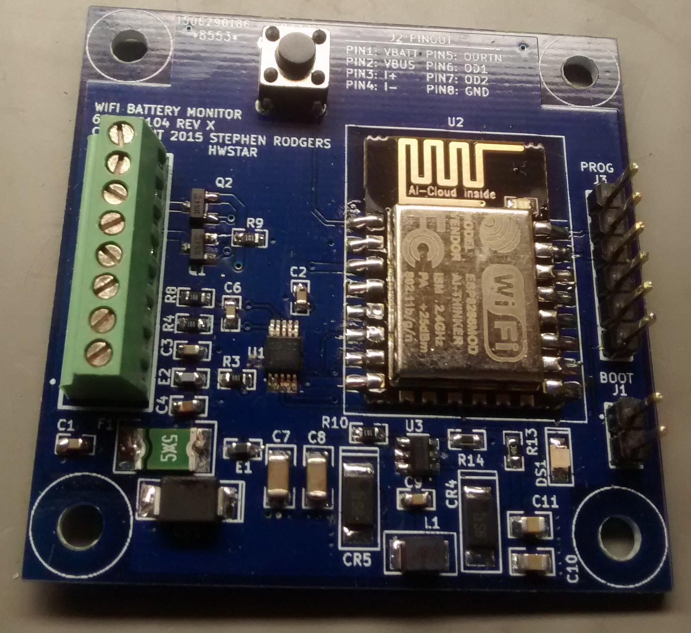

**ESP8266-MQTT-battery-monitor-hw**
==========
This is the hardware implementation for my ESP8266-MQTT-battery-monitor project.

**Features:**

This board contains an ESP12 module, a Texas Instruments LMR12010X DC-DC converter and an Texas Instruments INA226 DC voltage and current monitor.
The board can be powered from any voltage from 5.5V to 16V. It is optimized to work with 12V lead acid batteries. There is transient protection
on the power input, and voltage and current inputs. There is a 1/2 amp PTC fuse on the power input.

A wide range of current shunts can be used on the differential current inputs, and the shunt
current and full scale millivolt values are programmable in the firmware. The current value is and integer, and will be negative if the battery is being discharged.

**EDA Software**

This board was designed using KICAD. 

**Board Size**

5cm x 5cm

**Firmware**

The firmware for this project can be found [here](https://github.com/hwstar/ESP8266-MQTT-battery-monitor-fw)

**LICENSE**

Creative Commons Attribution Share-Alike license. (CC-BY-SA)

**Disclaimer**

Build and use at your own risk. I will not be responsible for any damages including but not limited to: errors or omissions, loss of life, or property damage. You have been warned.

